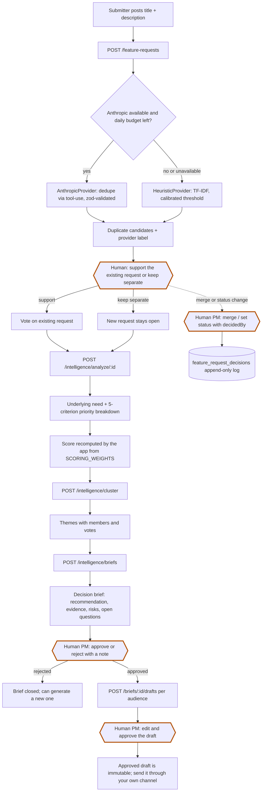
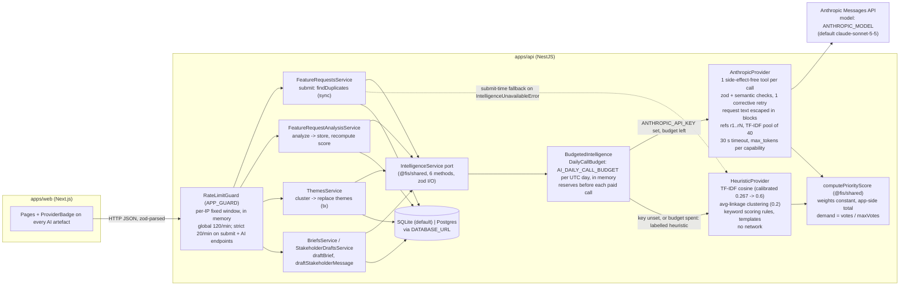

# Feature Intelligence System (FIS)

A pnpm monorepo (NestJS API, Next.js web app, shared zod contracts) that turns free-text
feature requests into a product manager's decision queue. On submit it surfaces likely
duplicates; on demand it extracts the underlying need, scores priority with a per-criterion
breakdown, clusters requests into themes, drafts a decision brief, and drafts stakeholder
updates per audience. Every AI step goes through one `IntelligenceService` port with two
adapters: an Anthropic adapter (tool-use structured output, zod-validated) and an
in-process heuristic adapter (TF-IDF, keyword rules, templates) that runs with no API key.
Every AI artefact is labelled with the engine that produced it, and every state change
(merge, status, brief approval, draft approval) is a separate endpoint that records a human
name. The AI recommends; a person decides.

This README is written from the code as it exists today. Where the PRD or spec says
something the code does not do, the code wins and the gap is named in
[Assumptions, risks and known limitations](#assumptions-risks-and-known-limitations).

## Contents

- [The business problem](#the-business-problem)
- [Who benefits](#who-benefits)
- [Why AI, and how the workflow changes](#why-ai-and-how-the-workflow-changes)
- [Quick start](#quick-start)
- [Request lifecycle](#request-lifecycle)
- [Feature tour: the five screens](#feature-tour-the-five-screens)
- [AI architecture](#ai-architecture)
- [Where human judgment stays](#where-human-judgment-stays)
- [Success metrics](#success-metrics)
- [Evaluation results](#evaluation-results)
- [Architecture decisions and tradeoffs](#architecture-decisions-and-tradeoffs)
- [Assumptions, risks and known limitations](#assumptions-risks-and-known-limitations)
- [How AI was used in development](#how-ai-was-used-in-development)
- [Repository map](#repository-map)
- [API surface](#api-surface)
- [Demo script and security review](#demo-script-and-security-review)

## The business problem

Feature requests arrive from customers, prospects, support and sales as free text and land in
one queue. The PRD (`docs/prds/feature-intelligence-system.md`, section 1) names the symptoms:
the same ask filed many times in different words; requests that describe a solution rather
than the need behind it; vote counts that reward loud requesters rather than strategic value;
prioritisation that differs by PM and cannot be explained; and stakeholders who never hear the
decision, so the request gets filed again.

**The prioritised problem is triage and decision-making on unstructured requests.** It was
chosen over a better voting portal, a roadmap publishing tool or a ticketing integration
because it is the bottleneck every other symptom feeds into, because it is the one place
where AI changes the nature of the work rather than the convenience of it, and because its
success is measurable with three numbers (see [Success metrics](#success-metrics)).

## Who benefits

| Persona | What they do here | What they get |
|---|---|---|
| Product manager (primary) | Triage, merge, status, scoring, brief decisions, draft approval | A decision-ready ranked queue instead of a reading queue; a priority with a breakdown they can defend |
| Support / sales submitter | Files requests on behalf of customers | Duplicate candidates right after submit, with a one-click "support this one instead" |
| Customer requester | Files or votes directly | Fewer dead-end duplicates; a request status they can check |
| Engineering lead | Reads briefs and themes | The underlying need and the cluster of related asks, not one ticket in isolation |

The PM is the primary beneficiary. The other three benefit through the PM's output and through
duplicate hints at submit time.

## Why AI, and how the workflow changes

The inputs are unstructured text. Detecting a duplicate across paraphrase ("Download dashboard
data as spreadsheet" vs "Export reports to CSV"), stating the need behind a solution, naming
a group of related asks, and drafting a brief are language tasks that keyword rules do poorly
and humans do slowly. The system does them in seconds and hands the result to a human.

| Step | Before | After (what the code does) |
|---|---|---|
| Submit | Free text lands in the queue | `POST /feature-requests` stores the request, then runs `findDuplicates` synchronously and returns up to 5 candidates with similarity and rationale; the submitter can vote for one instead ("Support this one instead") or keep theirs |
| Understand | PM reads and re-reads | `POST /intelligence/analyze/:id` (called by the web app right after submit) stores the underlying need, duplicate candidates and a priority score with a 5-criterion breakdown and rationale |
| Group | PM remembers related asks, or does not | `POST /intelligence/cluster` groups all non-merged requests into named themes with a summary (Themes page, "Re-cluster") |
| Score | PM intuition | Triage page lists open requests sorted by `priorityScore`; the score is the weighted sum of `reach`, `impact`, `strategicFit`, `effortInverse`, `demand`, computed by the application from the stored breakdown |
| Decide | PM writes a note somewhere | `POST /intelligence/briefs` drafts a brief (recommendation, evidence, risks, open questions); `PATCH /briefs/:id/decision` records approve or reject with `decidedBy` |
| Communicate | Nobody is told | `POST /briefs/:id/drafts` drafts an update for `requesters`, `leadership` or `engineering`; a PM edits and marks it `approved` via `PATCH /drafts/:id`. The system never sends anything |

Every step that previously required reading everything now starts from a structured,
labelled artefact and ends with a recorded human action.

## Quick start

Requirements: Node `>=20` and pnpm `10.26.1` (both pinned in the root `package.json`). No
database server and no API key are needed.

```sh
pnpm install
pnpm --filter @fis/api seed        # nest build && node dist/database/seed/seed.js
pnpm dev                           # builds @fis/shared, then runs api + web in parallel
```

- API: `http://localhost:3001/api/v1` (health: `GET /api/v1/health`)
- Web: `http://localhost:3000`

`pnpm dev` is the root script `pnpm --filter @fis/shared build && pnpm -r --parallel dev`. To
run the apps separately: `pnpm --filter @fis/api dev` (`nest start --watch`, port 3001) and
`pnpm --filter @fis/web dev` (`next dev --port 3000`). Build `@fis/shared` first either way.

The seed inserts 18 requests across five overlapping topics (identity, reporting,
notifications, integrations, mobile) with deliberate near-duplicates and a shared voter pool.
It is idempotent: rows that already exist are left untouched, so merges and status changes
made during a demo survive a re-seed (`apps/api/src/database/seed/seed.ts`).

### Configuration

All variables are optional. `.env.example` at the repo root lists them with their defaults.

| Variable | Default | Effect |
|---|---|---|
| `ANTHROPIC_API_KEY` | unset | Unset selects `HeuristicProvider` (no network). Set selects `AnthropicProvider`. Chosen once at boot (`apps/api/src/intelligence/intelligence.module.ts`) |
| `ANTHROPIC_MODEL` | `claude-sonnet-5-5` | Model id for every Anthropic call |
| `DATABASE_URL` | `./data/fis.sqlite` | A `postgres://` or `postgresql://` URL switches the TypeORM driver to Postgres; migrations run at boot on both |
| `PORT` | `3001` | API listen port |
| `WEB_ORIGIN` | `http://localhost:3000` | CORS allow-origin |
| `THROTTLE_WINDOW_SECONDS` | `60` | Length of the per-IP rate-limit window (1 to 3600) |
| `THROTTLE_LIMIT` | `120` | Requests per window per IP on every endpoint (1 to 100000) |
| `THROTTLE_STRICT_LIMIT` | `20` | Requests per window per IP on `POST /feature-requests` and the four AI endpoints, applied on top of the global limit |
| `AI_DAILY_CALL_BUDGET` | `500` | Anthropic calls per UTC day per API process; once spent, every capability is answered by the heuristic provider and labelled so. `0` disables the Anthropic path while keeping the key configured (0 to 1000000) |
| `NEXT_PUBLIC_API_URL` | `http://localhost:3001/api/v1` | Web to API base URL (web only); its origin is also allowed in the web CSP `connect-src` |

**The API does not load a `.env` file.** `loadEnv` in `apps/api/src/config/env.service.ts`
reads `process.env` only and there is no dotenv dependency, so copying `.env.example` to
`.env` has no effect on the API by itself. Export the variables in the shell instead:

```sh
ANTHROPIC_API_KEY=sk-... pnpm --filter @fis/api dev
# optionally: ANTHROPIC_MODEL=<model id>
```

The header of the web app shows which provider the API booted with (from `GET /health`), and
every AI result carries a badge: `Rule-based (heuristic)` or `AI - anthropic <model>`. When
the daily budget is spent the header still says `anthropic` (health reports the boot-time
selection) while new artefacts are labelled `heuristic`; the artefact badge is the honest one.

Other scripts: `pnpm typecheck`, `pnpm lint`, `pnpm build` (root, fan out with `pnpm -r`);
`pnpm --filter @fis/api eval` (heuristic golden set, offline) and
`pnpm --filter @fis/api eval:anthropic` (requires `ANTHROPIC_API_KEY`).

## Request lifecycle

From submission to a human decision. Thick-bordered boxes are human actions; AI only drafts and recommends. Full notes in [docs/flow.md](docs/flow.md).



## Feature tour: the five screens

The header carries a **PM mode** switch with an "Acting as" name field
(`apps/web/src/features/pm-mode/`). It is a UI toggle stored in `localStorage`; the API does
not check it (ADR 0005). The name typed there is sent as `decidedBy` / `updatedBy` on every
decision.

| Screen | Route | What it does |
|---|---|---|
| Discover | `/` | Paginated list of requests with search (`q`), status and theme filters, and sort by `recent`, `votes` or `priority`. Vote once per browser (anonymous `voterKey` in `localStorage`). Shows the theme a request belongs to and its priority score when analysed |
| Submit | `/submit` | Title, description, author name. After submit: "These look similar" panel with up to 5 candidates (similarity, rationale, provider badge), "Support this one instead" (votes for the candidate) or "Keep mine separate"; the underlying-need analysis runs automatically and renders below with a retry button |
| Request detail | `/requests/[id]` | The request, vote button, analysis section (underlying need, priority breakdown, duplicate candidates, provider and prompt version, "Analyse" button), merged-in requests, and PM actions: change status (`open`, `under_review`, `planned`, `declined`) or merge into another request, both with an optional note |
| Themes | `/themes` | Themes produced by clustering with name, summary, member requests and provider badge; "Re-cluster" runs a full recompute; each theme has a brief panel (generate, approve/reject, draft stakeholder updates) |
| Triage | `/triage` | PM-only. Open requests ranked by priority score with rank, votes, score and provider badge; unanalysed items get an "Analyse to score" button; analysed items get the brief panel: generate brief, approve or reject with a note, then draft and edit one update per audience |

## AI architecture



### The port

`packages/shared/src/intelligence-port.ts` defines `IntelligenceService` with six methods:
`analyze`, `findDuplicates`, `cluster`, `scorePriority`, `draftBrief`,
`draftStakeholderMessage`. Inputs and outputs are zod schemas; the corpus is bounded to the
500 most recent non-merged requests (`MAX_CORPUS_SIZE`), duplicate results to 10, themes to
20. Implementations never write to the database, set `provider` on every output, and throw
`IntelligenceUnavailableError` (error code `dependency`) when they cannot produce a
schema-valid result. The provider is selected once at boot. Feature modules do not call
the boot-selected provider directly: they inject `BUDGETED_INTELLIGENCE_SERVICE`
(`apps/api/src/ai-budget/`), a wrapper that reserves one unit of the daily call budget
before each Anthropic call (a failed or timed-out call still counts) and routes every
capability to `HeuristicProvider` for the rest of the UTC day once `AI_DAILY_CALL_BUDGET`
is spent. The output keeps the label of the provider that actually produced it. With no
key configured nothing is metered.

### AnthropicProvider (`apps/api/src/intelligence/providers/anthropic/`)

- **Structured output by tool use.** Each call offers exactly one tool whose `input_schema` is
  generated from the output zod schema (`anthropic-tools.ts`, `zod-json-schema.ts`). The
  tools are named `record_*` and have no side effects. `tool_choice` is
  `{ type: 'auto', disable_parallel_tool_use: true }` because the current model rejects a
  forced tool choice; a response with no tool call is treated as a validation failure.
- **Validation and one corrective retry.** The tool input is parsed with the zod schema, then
  checked semantically (`checkCandidateRefs`, `checkThemeRefs`: every ref exists in the input
  and none repeats). A failure is fed back as an `is_error` `tool_result` and the model gets
  one more attempt (`MAX_ATTEMPTS = 2` in `anthropic-structured-call.ts`). A second failure
  throws `IntelligenceUnavailableError`; a `refusal` stop reason throws immediately.
- **Untrusted data delimiting (ADR 0006).** Request text enters prompts only inside
  `<request ref="rN">` blocks with `<`, `>` and `&` escaped (`prompt-data.ts`), so text cannot
  close its own block. Every system prompt (`apps/api/prompts/*.md`) states that block content
  is data, never instructions. Author names are never sent to the model.
- **Short refs, bounded pool.** Corpus entries are referenced as `r1..rN`; the tool schemas
  accept only `^r\d+$`. For `findDuplicates` and `analyze`, TF-IDF preselects at most 40
  candidates (`CANDIDATE_POOL_SIZE`) and the model judges only those. Threshold, ordering and
  limit are re-applied by the application after the call.
- **Scores are computed by the app.** The model returns `reach`, `impact`, `strategicFit`,
  `effortInverse` and a rationale; `demand` is `voteCount / maxVoteCount` and the total is
  `computePriorityScore` from `@fis/shared`. `FeatureRequestAnalysisService` recomputes the
  total again before storing, so a provider cannot bend the score (ADR 0007).
- **Bounds and logging.** SDK client with `timeout: 30_000` and `maxRetries: 2` (transport
  retries), `max_tokens` per capability (2048 to 4096), `output_config: { effort: 'low' }`.
  Every attempt logs `intelligence.call` with provider, capability, prompt version, model,
  attempt, duration, token counts and outcome. Prompt text and model output never reach logs.
- **Prompts are versioned files** under `apps/api/prompts/` with a `version:` front matter
  (`dedupe@1`, `analyze@1`, ...) and a changelog; every stored artefact carries
  `promptVersion` and `model`.

### HeuristicProvider (`apps/api/src/intelligence/providers/heuristic/`)

- **Duplicates:** TF-IDF cosine over stemmed, stop-word-filtered title and description terms
  (title weighted x2). Raw cosine between short paraphrases lives far below the port's 0.6
  default, so the raw score is mapped onto the caller scale by a monotonic piecewise-linear
  calibration anchored at `HEURISTIC_COSINE_AT_DEFAULT_THRESHOLD = 0.267` (raw 0.267 = caller
  0.6, `heuristic-dedupe.ts`). The rationale still shows the raw cosine and states "Heuristic
  match, not a language-model judgement".
- **Clustering:** agglomerative average-linkage over the same vectors, merge threshold 0.2,
  minimum theme size 2; names from top terms, summaries from member titles.
- **Scoring:** documented keyword rules per criterion (`heuristic-scoring-rules.ts`: a base,
  phrases that raise, phrases that lower), `demand` from votes, total via
  `computePriorityScore`.
- **Need, briefs, drafts:** the need quotes the requester; briefs and stakeholder messages are
  templates over the stored analyses.
- Its `promptVersion` names the algorithm revision (`heuristic-dedupe@2`, ...,
  `heuristic-versions.ts`). Heuristic calls are not logged.

### Why this architecture

- **Not an autonomous agent.** Every output feeds a human decision; there is no multi-step
  action to delegate. One structured call per capability is inspectable, cheap, and evaluable
  against a golden set. The only "tool" the model ever sees records its own output.
- **Not embeddings-only.** Embedding similarity is a good first-pass signal for duplicates and
  clusters, but it cannot state the underlying need, name a theme, explain a score or draft a
  brief. Those are generation tasks. A vector store would also make the no-key path impossible
  (ADR 0003); embeddings with pgvector are the stated production path for scale (ADR 0002).
- **A port with two adapters** keeps the demo runnable with zero setup, gives the model path a
  measured floor, and makes the fallback honest: every artefact is labelled, so a heuristic
  result is never mistaken for model quality.
- **Model choice:** `claude-sonnet-5-5` by default, configurable with `ANTHROPIC_MODEL`.

### Fallback scope

Falling back to the heuristic happens only on submit-time duplicate detection
(`FeatureRequestsService.findDuplicatesFor`): the request is already stored, so AI failure
never fails the submit, and the response's `provider` names the engine that actually produced
the candidates. Every other capability surfaces `IntelligenceUnavailableError` as HTTP 503
with `code: 'dependency'` and the UI shows a retry.

## Where human judgment stays

| Action | Who | AI contribution | Endpoint |
|---|---|---|---|
| Merge two requests | PM, with a name and optional note | Candidate list with similarity and rationale | `POST /feature-requests/:id/merge` |
| Change request status | PM | None; status is a human field | `PATCH /feature-requests/:id/status` |
| Approve or reject a brief | PM | The draft brief | `PATCH /briefs/:id/decision` (a decided brief cannot be re-decided: 409) |
| Edit and approve a stakeholder draft | PM | The draft text | `PATCH /drafts/:id` (drafts require an approved brief: 409 otherwise; an approved draft is immutable: 409 on any further edit) |
| Send any communication | A person, outside the system | Draft text only | None; the system never sends |
| Change scoring weights | Engineers, by PR | None | `SCORING_WEIGHTS` is a constant in `packages/shared/src/scoring.ts` (ADR 0007); there is no runtime or UI setting |

Port methods never mutate `status`, `mergedIntoId`, brief status or draft status (ADR 0004).
Clustering is the one AI result persisted without a human step: it rewrites theme membership
and never touches request status. Merge, status and decision endpoints write `decidedBy`,
`decidedAt` and a note on the row that changed. Merge and status changes also append a row
to the `feature_request_decisions` table (`kind` `merge` or `status`, who, note, when) in
the same transaction, so a later decision cannot overwrite the record of an earlier one.
The table is append-only by code, not by a database rule, and no endpoint reads it yet.
There is no unmerge endpoint. None of these endpoints verifies the name it is given.

## Success metrics

Baselines are assumptions stated as such in the PRD; nothing is measured yet because the
system has no production use. All three are derivable from stored columns; no telemetry
table exists.

| Metric | Target (PRD) | How it is measured from the data |
|---|---|---|
| Median triage time per request | Under 4 working hours (assumed baseline: 2 working days) | `feature_requests.created_at` to the first PM-authored `decided_at` on that request (status change or merge), median over a rolling window |
| Duplicate request rate | Under 8 percent (assumed baseline: 20 to 30 percent) | Count of merge events (`status = 'merged'`, `merged_into_id` set) divided by submissions in the window. The spec adds an AI-quality target: at least 80 percent of human-confirmed merges were surfaced as a candidate at submit time |
| Time from decision to stakeholder update | Under 1 working day for 90 percent of approved briefs | `decision_briefs.decided_at` to the first `stakeholder_drafts.updated_at` with `status = 'approved'` |

No query or dashboard for these exists in the repository today; the columns do.

## Evaluation results

Golden-set evals live in `apps/api/evals/` (`golden.json`, `run.ts`, `scorers.ts`,
`need-judge.ts`). `pnpm --filter @fis/api eval` runs the heuristic provider offline and
writes `RESULTS.md` plus a row in `history.json`. The numbers below are copied from
`apps/api/evals/RESULTS.md` (run 2026-10-06T23:40:55Z, `golden@2`, `heuristic-dedupe@2`).

| Capability | Metric | Result |
|---|---|---|
| findDuplicates | precision at default threshold 0.6 | 70.0% |
| findDuplicates | recall at default threshold 0.6 | 100.0% |
| findDuplicates | case pass rate | 10/12 (83.3%) |
| findDuplicates | near-miss pairs wrongly returned | 3 |
| findDuplicates | separation checks (dup >= 0.6, distinct < 0.4) | 18/24 (75.0%) |
| scorePriority | score inside expected band | 5/5 (100.0%) |
| scorePriority | rank agreement (ordered pairs) | 5/5 (100.0%) |
| analyze (need) | keyword inclusion | 1/2 (50.0%) |
| cluster | duplicate pairs in same theme | 5/5 (100.0%) |
| cluster | unrelated pairs kept apart | 4/4 (100.0%) |

What those numbers mean, honestly:

- The first run (`golden@1`, uncalibrated) had **0% recall** at the port default: real
  duplicates scored raw cosine 0.26 to 0.35. The calibration anchor fixed recall; the
  `history.json` table in `RESULTS.md` keeps both rows.
- **Three near-miss violations remain.** Two failing cases are the password-reset family:
  "Reset password by SMS" scores 0.64 against the password-reset-email bug, and the
  "reset emails not arriving" duplicate ties its must-not-match pair at 0.63. These share
  the words "reset", "password" and "email"; no lexical signal separates them. They are left
  in the golden set as a known heuristic limitation rather than tuned away (evals/README.md).
- The gap between the weakest true duplicate (raw 0.271) and the strongest near miss (raw
  0.263) is **0.008**. The anchor is fitted to five positives and must be re-swept whenever
  the tokenizer, synonym table or golden set changes.
- The heuristic need extraction fails the implicit-goal case because it quotes the requester
  verbatim; the model path is scored by an LLM judge instead.
- **The Anthropic path has not been run live.** The adapter and the judge are typechecked
  and reviewed, but this repository has no `ANTHROPIC_API_KEY` in CI and
  `RESULTS.anthropic.md` does not exist. Before trusting the model path, run
  `ANTHROPIC_API_KEY=... pnpm --filter @fis/api eval:anthropic` locally (about 20 model calls
  plus 2 judge calls).

## Architecture decisions and tradeoffs

Full records are in `docs/adr/` (nine ADRs, indexed in `docs/adr/README.md`).

| Decision | Chosen | Rejected | Tradeoff accepted |
|---|---|---|---|
| Database (ADR 0002) | SQLite via TypeORM `better-sqlite3` by default; Postgres when `DATABASE_URL` is a `postgres://` URL; migrations run at boot, `synchronize` off | Postgres-only with docker-compose; in-memory store | Column types limited to what both drivers share; JSON columns are opaque in SQLite, so the sortable priority score is denormalised; no pgvector until a later ADR |
| Authentication (ADR 0005, amended) | None. Anonymous `voterKey` in `localStorage`; PM role is a UI toggle; `decidedBy` is free text. After the security review: per-IP rate limit, daily AI call budget, JSON content-type gate against cross-site requests | Email + password; IP-based vote dedupe; shared secret header | Votes can be stuffed with arbitrary `voterKey` values up to the rate limit; merge, status and approvals are anonymous and merge cannot be undone; the whole API is open on the configured origin. Production path: SSO + RBAC, `decidedBy` from the session |
| Search | SQL `LOWER(...) LIKE :pattern ESCAPE '\'` over title and description with escaped wildcards (`feature-requests.repository.ts`) | Full-text index; vector search | Substring match only, no ranking or stemming; fine for hundreds to low thousands of rows, which is the PRD's assumed volume |
| Repository layout (ADR 0001) | One pnpm workspace: `apps/api`, `apps/web`, `packages/shared` with frozen zod contracts | Two repos with a published contracts package; Next.js route handlers as the API | A contract change is one PR touching shared plus both consumers; strict hoisting means every package declares its own deps |
| Dedupe on submit | Synchronous `findDuplicates` inside `POST /feature-requests`, after the insert, with heuristic fallback | Background job; live hints while typing | The submit response waits for the model call (up to 30 s timeout on the Anthropic path); AI failure never fails the submit, and the response is labelled with the engine that answered |
| AI boundary (ADR 0003, 0004, 0006) | One port, two adapters, structured tool output, request text as delimited data, humans own every state transition | Anthropic-only; regex-parsed completions; silent fallback; auto-merge above a threshold; a DB tool for the model | More endpoints than CRUD; a capability change touches the interface and both adapters |
| Scoring (ADR 0007) | `SCORING_WEIGHTS` constant; the app computes the total from the breakdown | DB-stored editable weights; model-produced totals; per-env weights | Changing a weight is a code change; all stored scores stay recomputable from their breakdowns |
| Heuristic threshold (ADR 0008) | Calibrated anchor mapping raw cosine onto the port's 0.6 scale | Lowering the shared default for both providers; embeddings for the no-key path | Heuristic and Anthropic similarities are on one nominal scale but mean different things; the provider badge tells the reader which. Note: ADR 0008's text rejects rescaling and says "implementation pending"; the code implements the rescaling and the ADR has not been updated |
| Provenance (ADR 0009, amended) | `provider` (and `model` iff anthropic) on every artefact and on the submit, list, cluster and health responses; `decided_by` / `decided_at` / `decision_note` columns on `feature_requests`; since the security review, an append-only `feature_request_decisions` table written in the merge and status transactions | `isFallback` boolean; per-candidate provider | The three audit columns on requests are DB-only and the decisions table has no endpoint; the `FeatureRequest` API schema does not expose them yet |

## Assumptions, risks and known limitations

Stated plainly, from the code:

- **No authentication or authorization.** Every endpoint is open to the configured CORS
  origin. PM mode is a client-side switch. `decidedBy`, `updatedBy` and `authorName` are
  self-declared. Merge, status change, brief decision and draft approval are therefore
  anonymous, and a merge cannot be undone (no unmerge endpoint). The security review
  (`docs/security-review.md`) rates this HIGH and it is accepted by design (ADR 0005).
- **Rate limiting and AI spend are bounded per process, not per caller.** `RateLimitGuard`
  applies a per-IP fixed window to every endpoint (`THROTTLE_LIMIT` 120 per
  `THROTTLE_WINDOW_SECONDS` 60 by default) and a stricter one (`THROTTLE_STRICT_LIMIT` 20)
  to `POST /feature-requests` and the four AI endpoints; `DailyCallBudget` caps Anthropic
  calls at `AI_DAILY_CALL_BUDGET` (500) per UTC day, after which the heuristic provider
  answers with its own label. Both live in process memory: a restart resets them, N
  instances allow N times the limit, clients behind one proxy or NAT share one bucket
  (`trust proxy` is off, so the socket address is the key), and a fixed window allows a
  2x burst at the boundary. The budget counts calls, not tokens. `GET /health` keeps
  reporting the boot-time provider after the budget is spent. With `ANTHROPIC_API_KEY` set,
  an anonymous caller can still spend up to the budget every day; do not expose this
  deployment beyond a trusted network.
- **Vote stuffing is possible.** The API accepts any `voterKey` of 8 to 64 characters; a
  script can vote with arbitrary keys up to the rate limit and raise `demand`, which is 15
  percent of the priority score. Rated MEDIUM in the review and not fixed.
- **Transport hardening is in place, with limits.** `POST`/`PATCH`/`DELETE` without
  `Content-Type: application/json` get 415 (this forces cross-site browsers into a
  preflight the CORS allowlist refuses; a direct HTTP client just adds the header). Bodies
  over 64 kB get 413 and malformed JSON gets 400, both with fixed messages. Both apps send
  security headers and no `X-Powered-By`; the web CSP needs `script-src 'unsafe-inline'`
  because the App Router is not rendered with per-request nonces, so it does not stop
  injected inline script. HSTS is sent by the web app only in production.
- **Not scanned.** No dependency CVE audit was run and nothing in the repository records
  one.
- **The Anthropic path is untested live** (see [Evaluation results](#evaluation-results)).
- **Heuristic limits.** Bag-of-words cannot separate same-topic near misses (the
  password-reset family); the separation margin is 0.008; need extraction quotes the
  requester instead of inferring the goal; scoring is keyword rules with a documented base and
  step, a transparent floor rather than a model of the product. Every heuristic artefact says
  so in its badge and rationale.
- **No automated tests, by choice.** `[tests] skipped - not requested`: tests were declared
  out of scope in the spec and none exist (`*.test.ts` / `*.spec.ts`: none). What exists
  instead is typecheck and lint at the root, and the golden-set eval harness, which is the
  verification that matters for prompt and threshold changes.
- **`decisionNote` may contain names.** `decidedBy` is deliberately stripped before a brief
  reaches a model or a stored draft (`stakeholder-brief.mapper.ts` is an allowlist), but the
  free-text `decisionNote` is included and not redacted. A PM who writes a person's name in
  the note sends it to the model provider and may see it in the generated draft.
- **Clustering is a full replace.** Re-clustering deletes membership and rebuilds it in one
  transaction; a theme referenced by a brief is kept but hidden once it has no members, so a
  brief may point at a theme that is no longer listed.
- **Submit waits for dedupe.** On the Anthropic path a slow model call delays the submit
  response by up to the 30 s client timeout before falling back.
- **Documents that overstate the code.** The PRD describes live duplicate hints while typing
  and a `source` field (customer, prospect, support, sales); the code shows candidates after
  submit and has no `source` field. The PRD says every capability falls back to the heuristic;
  only submit-time dedupe does. The spec names a forced `tool_choice`; it is `auto` (ADR 0003
  amendments). The spec places the golden set under `apps/api/src/intelligence/evals/`; it is
  at `apps/api/evals/`. ADR 0008 is marked "implementation pending" and rejects rescaling,
  which the code now does. ADRs 0002, 0005 and 0009 carry "Amendments" sections
  reconciling them with the post-review code rather than rewritten text.
- **Local-only data.** The SQLite file is created under `./data/` and is gitignored; nothing
  is backed up.
- **Scale assumptions.** Hundreds to low thousands of requests, one product line, one PM
  team, no multi-tenancy. Full-corpus clustering prompts do not scale past a few hundred
  requests; the bound is 500.

## How AI was used in development

The project was built with Claude Code under the EngineOS workflow that governs this
workspace. What the repository records, without overclaiming:

- **Spec-first.** The order was PRD (`docs/prds/`), work breakdown into 15 tickets
  (`docs/tickets/`), ADRs 0001 to 0007, then the specification
  (`docs/specs/2026-10-06-feature-intelligence-system.md`) with frozen contracts, before any
  application code. ADRs 0008 and 0009 were written during implementation when the code and
  the spec disagreed; ADR 0003 carries an "Amendments" section reconciling it with what was
  actually built.
- **Router and waves.** A router classified the request (medium risk, three waves). Wave 1
  produced the documents; a contracts agent then wrote `@fis/shared` and the workspace files;
  wave 2 ran backend, AI module and frontend agents in parallel, each with a disjoint file
  scope (the owner-unit table in `docs/tickets/README.md`) and the frozen contracts as input;
  a fix pass followed (backend, LLM threshold and `decidedBy` stripping, web, security review,
  docs). Two additive contract changes were frozen between waves (`provider` on the submit
  response, `priorityProvider` on list items).
- **Prompt log.** `prompts.txt` at the repo root records each instruction received and a
  one-line summary of the response, ISO-timestamped. At the time of writing it holds five
  entries covering the brief, the plan, wave 1, the contracts step, and the wave 2 integration;
  it is a log of orchestration turns, not of every model call.
- **Where human review happened.** Contract conflicts between the spec and acceptance
  criteria were resolved by decision (recorded in the spec's "Resolved open questions" and
  ADR 0009); the first eval run exposed 0% heuristic recall and led to the calibration in ADR
  0008 and `heuristic-dedupe@2`.
- **Security review.** A read-only review after wave 2 returned "merge with fixes": two
  HIGH findings accepted by design (AI cost amplification without auth; anonymous,
  irreversible merge and status power), one MEDIUM not fixed (vote stuffing), and a set of
  fixes that landed (rate limit, daily AI budget, content-type gate, fixed body-parser
  messages, security headers, append-only decision log, immutable approved drafts, `page`
  cap). `docs/security-review.md` is the record, written from the code; the review's raw
  output is not in the repository.
- **What this is not.** No claim is made that the output was produced unattended or that
  every line was reviewed by a person.

## Repository map

```
.
|-- package.json                 root scripts: dev, build, lint, typecheck (pnpm -r)
|-- pnpm-workspace.yaml
|-- .env.example                 variable names and defaults (not loaded by the API)
|-- prompts.txt                  development prompt log
|-- docs/
|   |-- prds/feature-intelligence-system.md
|   |-- specs/2026-10-06-feature-intelligence-system.md
|   |-- adr/0001..0009 + README.md
|   |-- tickets/FIS-1..FIS-15 + README.md
|   |-- security-review.md        findings, fixes, accepted limitations
|   `-- demo.md                   five-minute demo script
|-- packages/shared/src/         @fis/shared: zod schemas, API_ROUTES, IntelligenceService port,
|                                SCORING_WEIGHTS, computePriorityScore
|-- apps/api/
|   |-- prompts/                 versioned prompt files: analyze, dedupe, cluster, score, brief, stakeholder
|   |-- evals/                   golden.json, run.ts, scorers.ts, need-judge.ts, RESULTS.md, history.json
|   `-- src/
|       |-- config/              zod env schema, EnvService (the only process.env reader)
|       |-- common/              correlation id, JSON logger, exception filter, zod pipe, clock
|       |-- security/            rate-limit guard + decorator, content-type gate, body-parser errors, security headers
|       |-- ai-budget/           DailyCallBudget, BudgetedIntelligence wrapper every feature module injects
|       |-- database/            entities, two migrations, seed, unit of work, driver selection
|       |-- feature-requests/    submit + dedupe, list/search, detail, status, merge, analyze, decision log
|       |-- votes/               add/remove votes, vote transfer on merge
|       |-- analyses/            stored analyses, priority provenance for the list
|       |-- themes/              clustering and theme read-back
|       |-- briefs/              decision briefs, decisions, stakeholder drafts
|       |-- intelligence/        port wiring, prompts loader, providers/anthropic, providers/heuristic
|       `-- health/              GET /health: database up/down, provider, version
`-- apps/web/src/
    |-- app/                     (discover)/, submit/, requests/[id]/, themes/, triage/
    |-- features/                submit, discover, request-detail, analysis, themes, triage, briefs, votes, pm-mode
    |-- components/              ui (ProviderBadge, badges, states, pagination), layout (nav, health)
    `-- lib/                     typed API client (zod-parsed responses), config, storage
```

## API surface

All routes are under `/api/v1` (`API_PREFIX`, `API_ROUTES` in `packages/shared/src/api.ts`).
Requests are validated with zod; errors return
`{ statusCode, code, message, correlationId }` with `code` in `validation`, `not_found`,
`conflict`, `rate_limited` (429, with a `Retry-After` header), `dependency`, `internal`
(`auth` is reserved). Every `POST`, `PATCH` and `DELETE` must send
`Content-Type: application/json`, bodiless ones included, or it gets 415; bodies over
64 kB get 413 and malformed JSON 400, with fixed messages. The `x-correlation-id` header
is echoed or generated. Endpoints marked "strict" below share the stricter per-IP limit.

| Method and path | Purpose |
|---|---|
| `POST /feature-requests` | Create; returns `{ request, duplicateCandidates, provider }` (strict) |
| `GET /feature-requests` | List; `q`, `status`, `themeId`, `sort=recent|votes|priority`, `page` (max 10000), `limit` (default 20, max 100) |
| `GET /feature-requests/:id` | `{ request, analysis | null, votes, mergedRequests }` |
| `POST` / `DELETE /feature-requests/:id/votes` | Add or remove a vote by `voterKey` |
| `POST /feature-requests/:id/merge` | Merge into `targetId` with `decidedBy`, optional `note`; votes transfer, duplicates dropped; appends a `merge` decision row; not reversible |
| `PATCH /feature-requests/:id/status` | Set `open`, `under_review`, `planned` or `declined` with `decidedBy`, optional `note`; appends a `status` decision row |
| `POST /intelligence/analyze/:id` | Run analysis and store it; returns `Analysis` (strict, budgeted) |
| `POST /intelligence/cluster` | Full recompute of themes; `{ themes, provider }`; 409 with fewer than 2 requests (strict, budgeted) |
| `GET /themes` | Themes with at least one member |
| `POST /intelligence/briefs` | Draft a brief for `{ themeId }` or `{ featureRequestId }` (strict, budgeted) |
| `GET /briefs` | Read back briefs by `themeId`, `featureRequestId`, `status` |
| `PATCH /briefs/:id/decision` | `approved` or `rejected` with `decidedBy`, optional `decisionNote`; 409 once decided |
| `POST /briefs/:id/drafts` | Draft for `requesters`, `leadership` or `engineering`; requires an approved brief (strict, budgeted) |
| `GET /briefs/:id/drafts` | Read back drafts |
| `PATCH /drafts/:id` | Edit `body` and/or set `status` with `updatedBy`; 409 once approved |
| `GET /health` | `{ status: 'ok', database: 'up' | 'down', provider, version }`; `provider` is the boot-time selection, not the budget state |

## Demo script and security review

- **Demo script:** [`docs/demo.md`](docs/demo.md) is the five-minute Loom walkthrough
  (submit a near-duplicate, vote instead, analyze, re-cluster, merge, brief, approve, draft),
  with the exact commands and the choice between the heuristic and Anthropic path. It is the
  FIS-15 deliverable.
- **Security review:** [`docs/security-review.md`](docs/security-review.md) records the
  review verdict, the findings by severity, the fixes that landed with the code they live
  in, what was not scanned, and the limitations accepted by design.
- **Planning documents:** PRD [`docs/prds/feature-intelligence-system.md`](docs/prds/feature-intelligence-system.md),
  ticket index [`docs/tickets/README.md`](docs/tickets/README.md), ADR index
  [`docs/adr/README.md`](docs/adr/README.md), spec
  [`docs/specs/2026-10-06-feature-intelligence-system.md`](docs/specs/2026-10-06-feature-intelligence-system.md).
