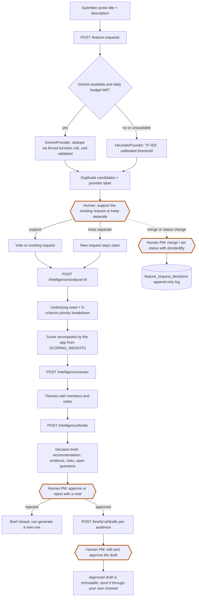

# Request lifecycle: from submission to human decision

Every box with a double border is a human action. AI only drafts and recommends;
no AI endpoint changes a request status, a merge link, a brief decision or a draft status.

## Reading the diagram

- Provider label: every AI artefact carries `provider` (`gemini` or `heuristic`) and the UI shows it.
- Fallback: the heuristic path is used when no API key is set, when the Gemini call fails after one corrective retry, or when the daily call budget is exhausted.
- Rate limits: submit and every AI endpoint are on the strict per-IP limit (see `docs/security-review.md`).
